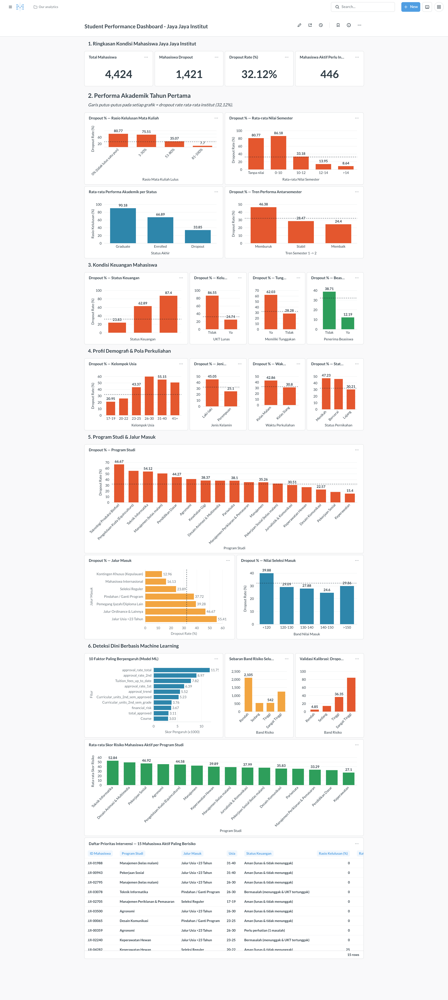
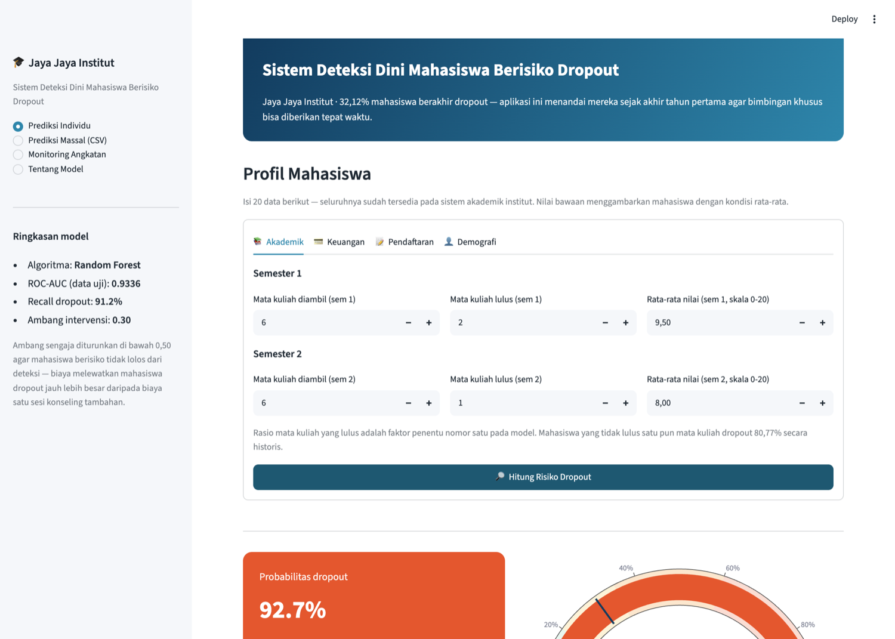
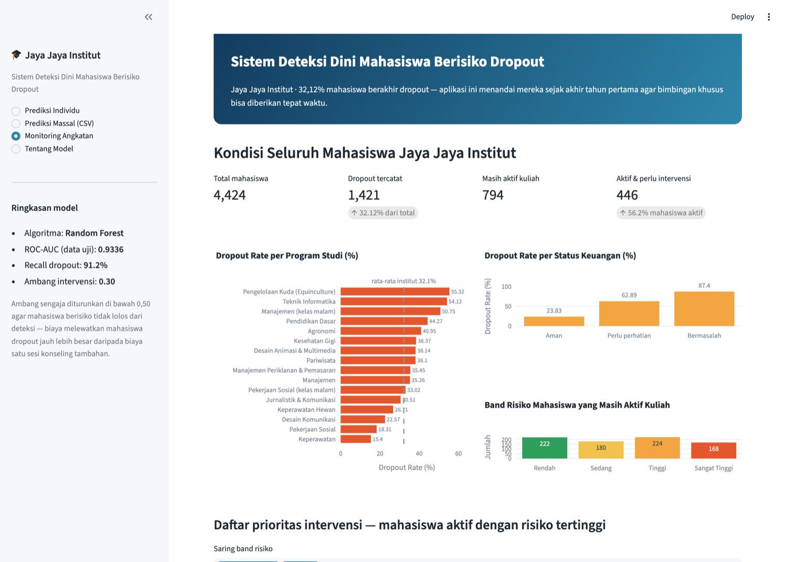

# Proyek Akhir: Menyelesaikan Permasalahan Institusi Pendidikan

**Jaya Jaya Institut** — perguruan tinggi yang berdiri sejak tahun 2000 dan telah mencetak
banyak lulusan dengan reputasi sangat baik, namun menghadapi angka **dropout yang tinggi**.

| | |
|---|---|
| **Nama** | Nafiul Irsad |
| **Email** | nafiulirsad@gmail.com |
| **Id Dicoding** | nafiulirsad |

---

## Business Understanding

Jaya Jaya Institut memiliki data historis **4.424 mahasiswa** lengkap dengan profil demografi,
riwayat pendaftaran, kondisi keuangan, serta performa akademik dua semester pertama. Dari
seluruh mahasiswa tersebut, **1.421 orang (32,12%) berakhir dropout** — hampir satu dari tiga
mahasiswa. Angka ini jauh di atas tingkat dropout yang wajar untuk perguruan tinggi dan
berdampak langsung pada pendapatan institusi, rasio kelulusan, serta reputasi akademik yang
selama ini dijaga.

Persoalan utamanya bukan sekadar besarnya angka, melainkan **institut baru mengetahui seorang
mahasiswa dropout setelah kejadiannya berlangsung**. Padahal jejak masalahnya — tunggakan UKT,
mata kuliah yang tidak lulus, nilai semester yang jatuh — sudah terlihat jauh sebelum mahasiswa
benar-benar berhenti kuliah. Manajemen meminta dua hal: **mendeteksi secepat mungkin mahasiswa
yang berpotensi dropout** agar dapat diberi bimbingan khusus, dan **membuat dashboard** untuk
memudahkan pemahaman data serta pemantauan performa mahasiswa.

### Permasalahan Bisnis

1. **Tingkat dropout mencapai 32,12%** (1.421 dari 4.424 mahasiswa) sehingga target kelulusan
   dan proyeksi pendapatan institut tidak tercapai.
2. **Faktor pendorong dropout belum teridentifikasi secara kuantitatif.** Manajemen belum
   mengetahui variabel mana yang paling menentukan dan segmen mahasiswa mana yang paling rentan.
3. **Belum ada mekanisme deteksi dini.** Tidak ada sistem yang menandai mahasiswa berisiko
   sebelum mereka berhenti kuliah, sehingga bimbingan khusus selalu terlambat diberikan.
4. **Tidak ada alat monitoring.** Data mahasiswa masih berupa berkas mentah; bagian akademik
   tidak dapat memantau performa per program studi, jalur masuk, atau status keuangan.
5. **794 mahasiswa berstatus masih aktif (Enrolled) belum terpantau.** Institut tidak mengetahui
   siapa di antara mereka yang perlu diintervensi pada semester berjalan.

### Cakupan Proyek

| Tahap | Keluaran |
|---|---|
| Data Understanding | Profil kualitas data 4.424 baris × 37 kolom, kamus data, pemeriksaan nilai kosong & duplikat |
| Exploratory Data Analysis | Dropout rate per segmen akademik, keuangan, demografi, program studi, dan jalur masuk (10 visualisasi) |
| Data Preparation | Binarisasi target, 9 fitur turunan (rasio kelulusan, tren nilai, risiko finansial), tabel analitik |
| Modeling | Perbandingan 3 algoritma + hyperparameter tuning `RandomizedSearchCV` (40 kombinasi × 5-fold) |
| Evaluation | ROC-AUC, PR-AUC, recall, F1/F2, pemilihan ambang operasional, permutation importance, kalibrasi band risiko |
| Deployment | Model `.joblib`, prototipe **Streamlit** (Streamlit Community Cloud), **business dashboard Metabase** di atas PostgreSQL via Docker |

### Persiapan

**Sumber data:** [Students' Performance — Dicoding Academy](https://github.com/dicodingacademy/dicoding_dataset/blob/main/students_performance/README.md)
(turunan dari *Predict Students' Dropout and Academic Success*, UCI Machine Learning Repository).
Dataset berisi **4.424 baris × 37 kolom**, dipisahkan dengan titik koma (`;`), tanpa nilai kosong
maupun baris duplikat. Salinan tersimpan di [data/data.csv](data/data.csv) agar seluruh proyek
dapat dijalankan ulang tanpa koneksi internet.

**Setup environment:**

```bash
# 1. Masuk ke direktori proyek
cd "Menyelesaikan Permasalahan Institusi Pendidikan"

# 2. Buat dan aktifkan virtual environment
python -m venv .venv
source .venv/bin/activate          # Windows: .venv\Scripts\activate

# 3. Pasang seluruh dependency
pip install -r requirements.txt

# 4. Jalankan notebook analisis (opsional — notebook sudah berisi seluruh output)
jupyter notebook notebook.ipynb
```

**Menjalankan business dashboard (Docker):**

```bash
# Siapkan berkas database Metabase yang sudah berisi dashboard jadi
mkdir -p metabase-data && cp metabase.db.mv.db metabase-data/

# Nyalakan PostgreSQL (otomatis ter-seed dari data/students_scored.csv) + Metabase
docker compose up -d

# Tunggu ±60 detik, lalu buka http://localhost:3030
```

**Membangun ulang dashboard dari nol (opsional):**

```bash
python scripts/setup_metabase.py --url http://localhost:3030
```

---

## Business Dashboard

Dashboard **"Student Performance Dashboard - Jaya Jaya Institut"** dibangun dengan
**Metabase v0.63.14.3** di atas **PostgreSQL 15** dan berisi **24 kartu visualisasi** yang
tersusun dalam enam seksi naratif — dari *seberapa parah* kondisinya, *mengapa* mahasiswa
berhenti, *siapa* yang rentan, sampai *siapa yang harus ditindaklanjuti minggu ini*.



| Akses | Nilai |
|---|---|
| URL | <http://localhost:3030/dashboard/2> |
| Email | `root@mail.com` |
| Password | `root123` |
| Nama dashboard | Student Performance Dashboard - Jaya Jaya Institut |
| Berkas database | [metabase.db.mv.db](metabase.db.mv.db) |
| Screenshot | [nafiulirsad-dashboard.png](nafiulirsad-dashboard.png) |

### Isi dashboard

| Seksi | Kartu | Pertanyaan bisnis yang dijawab |
|---|---|---|
| **1. Ringkasan Kondisi** | 4 KPI: Total Mahasiswa (4.424), Mahasiswa Dropout (1.421), Dropout Rate (32,12%), Mahasiswa Aktif Perlu Intervensi (446) | Seberapa parah kondisinya sekarang? |
| **2. Performa Akademik Tahun Pertama** | Rasio kelulusan mata kuliah, rata-rata nilai semester, performa rata-rata per status, tren antarsemester | Apakah performa akademik memisahkan dropout? |
| **3. Kondisi Keuangan** | Status keuangan gabungan, kelunasan UKT, tunggakan, beasiswa | Seberapa besar peran faktor keuangan? |
| **4. Demografi & Pola Perkuliahan** | Kelompok usia, jenis kelamin, waktu kuliah, status pernikahan | Siapa yang paling rentan? |
| **5. Program Studi & Jalur Masuk** | Dropout rate 17 program studi, 7 jalur masuk, band nilai seleksi | Di mana dropout terkonsentrasi? |
| **6. Deteksi Dini Berbasis ML** | 10 faktor paling berpengaruh, sebaran band risiko, validasi kalibrasi band, skor risiko mahasiswa aktif per program studi, dan daftar 15 mahasiswa prioritas intervensi | Siapa yang harus ditindaklanjuti semester ini? |

### Prinsip desain yang diterapkan

- **Satu pesan per grafik.** Setiap kartu menjawab satu pertanyaan; judul kartu memakai nama
  dimensinya dan sumbu nilai selalu diberi nama `Dropout Rate (%)`.
- **Konteks pembanding.** Seluruh grafik dropout memakai **garis putus-putus pada 32,12%**
  (rata-rata institut), sehingga pembaca langsung melihat segmen mana yang di atas normal —
  bukan sekadar membandingkan tinggi-rendah batang.
- **Warna bermakna, bukan dekoratif.** Oranye-merah `#E4572E` konsisten untuk metrik dropout,
  biru `#2E86AB` untuk metrik netral/model, hijau `#2E9E5B` untuk kondisi yang bersifat
  protektif (beasiswa) dan agregat skor risiko.
- **Urutan kategori mengikuti maknanya.** Kategori berjenjang (band usia, band nilai, band
  kelulusan, band risiko) diurutkan sesuai tingkatannya sehingga terbaca sebagai gradien,
  bukan diurutkan berdasarkan besar nilainya.
- **Integritas data.** Kategori dengan populasi sangat kecil tidak pernah dilipat menjadi
  batang "Other" yang nilainya dijumlahkan — seluruh 17 program studi ditampilkan apa adanya
  agar persentase tidak menyesatkan. Skor risiko yang ditampilkan adalah prediksi
  **out-of-fold**, sehingga setiap mahasiswa dinilai oleh model yang tidak pernah melihat datanya.

---

## Menjalankan Sistem Machine Learning

Prototipe dibangun dengan **Streamlit** dan sudah di-deploy ke **Streamlit Community Cloud**.

| Akses | Nilai |
|---|---|
| **URL prototipe** | **<https://jaya-jaya-institut-dropout.streamlit.app>** |
| Berkas aplikasi | [app.py](app.py) |
| Modul bersama | [preprocessing.py](preprocessing.py) |
| Model | [model/dropout_model.joblib](model/dropout_model.joblib) |

**Menjalankan secara lokal:**

```bash
# Pastikan dependency sudah terpasang (lihat bagian Persiapan)
source .venv/bin/activate
streamlit run app.py

# Aplikasi terbuka otomatis di http://localhost:8501
```

### Cara memakai aplikasi

Aplikasi memiliki empat halaman yang dapat dipilih pada sidebar.

**1. Prediksi Individu** — isi 20 data mahasiswa (dikelompokkan ke dalam tab Akademik, Keuangan,
Pendaftaran, dan Demografi), lalu tekan **Hitung Risiko Dropout**. Aplikasi menampilkan
probabilitas dropout, band risiko beserta bukti historisnya, *gauge* dengan penanda ambang
institut, daftar faktor risiko yang terdeteksi, dan rekomendasi tindakan yang menyesuaikan
profil mahasiswa.



**2. Prediksi Massal (CSV)** — unduh templat CSV, isi dengan data satu angkatan, lalu unggah
kembali. Aplikasi memberi skor seluruh baris sekaligus, menampilkan ringkasan sebaran band
risiko, dan menyediakan tombol unduh hasil skoring. Contoh berkas siap unggah tersedia di
[data/contoh_unggah_massal.csv](data/contoh_unggah_massal.csv).

**3. Monitoring Angkatan** — ringkasan kondisi seluruh 4.424 mahasiswa: dropout rate per program
studi dan per status keuangan, sebaran band risiko mahasiswa aktif, serta **daftar prioritas
intervensi** yang dapat disaring per band dan diunduh.



**4. Tentang Model** — metrik evaluasi, alasan pemilihan ambang, tabel kalibrasi band risiko,
faktor paling berpengaruh, dan batasan penggunaan model.

### Ringkasan model

| Aspek | Nilai |
|---|---|
| Algoritma terpilih | **Random Forest** (`n_estimators=861`, `max_depth=12`, `max_features='log2'`, `class_weight='balanced'`) |
| Kandidat yang dibandingkan | Logistic Regression, Random Forest, Hist Gradient Boosting |
| Dasar pemilihan | ROC-AUC validasi silang 5-fold pada data latih (**0,9171**) |
| ROC-AUC data uji | **0,9336** |
| PR-AUC data uji | **0,9003** (garis dasar kelas positif 0,32) |
| ROC-AUC out-of-fold (4.424 mahasiswa) | 0,9208 |
| Ambang operasional | **0,30** (memaksimalkan F2-score) |
| Recall pada ambang operasional | **91,20%** — hanya 25 dari 284 mahasiswa dropout yang lolos |
| Precision pada ambang operasional | 67,62% |

**Mengapa ambang 0,30 dan bukan 0,50?** Kedua jenis kesalahan tidak berbiaya sama. Melewatkan
mahasiswa yang benar-benar berisiko (*false negative*) berarti kehilangan mahasiswa beserta
pendapatan sisa masa studinya, sedangkan menandai mahasiswa yang ternyata aman
(*false positive*) hanya berbiaya satu sesi konseling. Menurunkan ambang dari 0,50 ke 0,30
menaikkan recall dari 82,4% menjadi **91,2%** — jumlah mahasiswa dropout yang lolos dari deteksi
turun setengahnya, dari 50 menjadi 25 orang.

**Kalibrasi band risiko** (diukur dengan prediksi out-of-fold pada seluruh 4.424 mahasiswa):

| Band | Rentang probabilitas | Jumlah mahasiswa | Dropout aktual |
|---|---|---|---|
| Rendah | < 20% | 2.105 | **4,8%** |
| Sedang | 20% – 35% | 534 | 14,0% |
| Tinggi | 35% – 60% | 542 | 36,3% |
| Sangat Tinggi | ≥ 60% | 1.243 | **84,2%** |

Kenaikannya monoton dengan rentang 17,5 kali lipat, sehingga label band dapat langsung dipercaya
sebagai urutan prioritas kerja unit bimbingan.

---

## Conclusion

**Jaya Jaya Institut kehilangan 32,12% mahasiswanya (1.421 dari 4.424) karena dropout, dan
proyek ini membuktikan bahwa mayoritas kasus tersebut dapat diprediksi jauh sebelum terjadi.**
Model Random Forest yang dibangun mencapai ROC-AUC **0,9336** pada data uji dan menangkap
**91,2% mahasiswa dropout** pada ambang operasional 0,30 — hanya dengan data yang **sudah
dimiliki institut pada akhir tahun pertama**, tanpa survei atau pengumpulan data baru.

**1. Apa penyebab utama dropout?** Ada dua akar masalah yang berdiri sendiri.

- **Kondisi keuangan.** Mahasiswa yang UKT-nya belum lunas dropout **86,55%** berbanding 24,74%
  pada yang lunas — selisih 3,5 kali lipat dan merupakan pemisah tunggal paling tajam di seluruh
  dataset. Status *debtor* menghasilkan pola serupa (62,03% vs 28,28%), sementara beasiswa
  terbukti protektif (12,19% vs 38,71%). Fitur `Tuition_fees_up_to_date` juga menempati posisi
  **ketiga** pada permutation importance model.
- **Keterlibatan akademik tahun pertama.** Mahasiswa yang tidak lulus satu pun mata kuliah
  dropout **80,77%**, sementara yang lulus 81-100% mata kuliah hanya **7,70%**. Rasio kelulusan
  mata kuliah (`approval_rate_total`, `approval_rate_2nd`) menempati dua posisi teratas pada
  permutation importance, dan semester kedua lebih prediktif daripada semester pertama
  (korelasi -0,66 vs -0,59).

**2. Siapa yang paling rentan?** Profil risiko tinggi terbentuk konsisten di beberapa dimensi:
mahasiswa **berusia 26-30 tahun (dropout 59,79%)**, **laki-laki (45,05%)**, **kelas malam
(42,86%)**, **berstatus menikah (47,23%)**, masuk lewat **jalur usia di atas 23 tahun (55,41%)**
atau **pemegang ijazah pendidikan tinggi lain (61,15%)**, dan terdaftar pada program studi
**Pengelolaan Kuda (55,32%)**, **Teknik Informatika (54,12%)**, atau **Manajemen kelas malam
(50,75%)**. Sebaliknya, Keperawatan — program studi terbesar dengan 766 mahasiswa — hanya
dropout 15,40%. **Masalah dropout tidak merata**, sehingga intervensi paling efisien bila
difokuskan pada segmen-segmen tersebut.

**3. Faktor apa yang paling menentukan menurut model?** Enam dari sepuluh fitur teratas adalah
fitur hasil rekayasa, dengan urutan: `approval_rate_total`, `approval_rate_2nd`,
`Tuition_fees_up_to_date`, `approval_rate_1st`, `approval_trend`,
`Curricular_units_2nd_sem_approved`, `Curricular_units_2nd_sem_grade`, `financial_risk`,
`total_approved`, dan `Course`. Kehadiran `approval_trend` di lima besar berarti model tidak
hanya melihat posisi mahasiswa, tetapi juga **arah perubahannya** — mahasiswa yang memburuk dari
semester 1 ke semester 2 lebih berisiko daripada yang stabil pada level yang sama.

**4. Apa hasil konkretnya sekarang?** Dari **794 mahasiswa yang masih aktif kuliah**, model
menandai **446 mahasiswa perlu intervensi**, dengan **168 di antaranya berada pada band Sangat
Tinggi** dan 224 pada band Tinggi. Berdasarkan kalibrasi band, kelompok Sangat Tinggi memiliki
probabilitas dropout aktual ± 84% — artinya **sekitar 141 dari 168 mahasiswa tersebut akan
berhenti kuliah bila tidak diintervensi**. Daftar nama lengkap beserta urutan prioritasnya
tersedia di [data/watchlist_enrolled.csv](data/watchlist_enrolled.csv), pada panel terakhir
dashboard, dan pada halaman *Monitoring Angkatan* aplikasi Streamlit.

### Rekomendasi Action Items

- **1. Jadikan tunggakan UKT sebagai alarm dropout, bukan sekadar urusan administrasi.**
  Terapkan aturan: mahasiswa yang UKT-nya lewat jatuh tempo **lebih dari 30 hari otomatis
  dirujuk ke unit bimbingan**, bukan hanya menerima surat tagihan. Dasarnya: 86,55% mahasiswa
  dalam kondisi ini berakhir dropout. Sediakan opsi cicilan, penundaan, atau beasiswa darurat —
  penerima beasiswa hanya dropout 12,19%, sepertiga dari non-penerima, sehingga memperluas
  beasiswa ke mahasiswa berisiko tinggi berpotensi menekan dropout paling besar per rupiah
  yang dikeluarkan.

- **2. Pasang sistem peringatan dini berbasis mata kuliah pada minggu ke-6 setiap semester.**
  Mahasiswa yang tidak lulus satu pun mata kuliah dropout **80,77%**, dan 676 mahasiswa berada
  dalam kondisi tersebut. Jangan menunggu nilai akhir semester: pantau kehadiran dan hasil
  evaluasi tengah semester, lalu wajibkan konseling akademik bagi mahasiswa dengan rasio
  kelulusan di bawah 50%. Prioritaskan pula mahasiswa dengan `approval_trend` negatif karena
  performa yang memburuk antarsemester termasuk lima besar penentu model.

- **3. Kerjakan daftar prioritas 168 mahasiswa band Sangat Tinggi pada semester berjalan.**
  Gunakan [data/watchlist_enrolled.csv](data/watchlist_enrolled.csv) atau panel
  "Daftar Prioritas Intervensi" pada dashboard. Tetapkan satu dosen wali sebagai penanggung
  jawab per mahasiswa, dengan target kontak maksimal dua minggu dan pencatatan hasil intervensi.
  Pencatatan ini penting karena menjadi data pelatihan putaran berikutnya untuk mengukur
  **program bimbingan mana yang benar-benar bekerja**.

- **4. Bentuk program pendampingan khusus untuk mahasiswa non-tradisional.**
  Mahasiswa jalur usia di atas 23 tahun (dropout 55,41%, 785 orang), kelas malam (42,86%), dan
  yang sudah menikah (47,23%) memiliki pola risiko yang sama: **kuliah bersaing dengan pekerjaan
  dan tanggung jawab keluarga**. Solusinya bukan bimbingan akademik biasa, melainkan
  fleksibilitas — kelas daring/rekaman, batas SKS lebih rendah pada tahun pertama, dan orientasi
  manajemen waktu di awal semester.

- **5. Lakukan audit kurikulum pada tiga program studi dengan dropout tertinggi.**
  Teknik Informatika (54,12%), Pengelolaan Kuda (55,32%), dan Manajemen kelas malam (50,75%)
  memiliki dropout **lebih dari tiga kali lipat** Keperawatan (15,40%). Selisih sebesar itu tidak
  dapat dijelaskan oleh profil mahasiswa saja. Periksa beban SKS tahun pertama, tingkat kelulusan
  per mata kuliah, dan kualitas pembimbingan akademik pada ketiga program studi tersebut, lalu
  pelajari apa yang membuat Keperawatan berhasil dan replikasikan.

**Cara mengukur keberhasilan.** Pantau tiga indikator pada dashboard setiap akhir semester:
(1) dropout rate keseluruhan dengan **target turun dari 32,12% menjadi di bawah 25% dalam dua
tahun**, (2) jumlah mahasiswa band Sangat Tinggi yang berhasil bertahan setelah diintervensi,
dan (3) dropout rate pada tiga program studi prioritas. Model perlu **dilatih ulang setiap akhir
tahun akademik** dengan data angkatan terbaru agar tetap relevan.

---

## Struktur Berkas

```
Menyelesaikan Permasalahan Institusi Pendidikan/
├── model/
│   ├── dropout_model.joblib          # Pipeline preprocessing + Random Forest terlatih
│   └── model_metadata.json           # Kontrak model: fitur, ambang, metrik, band risiko
├── data/
│   ├── data.csv                      # Dataset mentah dari Dicoding (4.424 x 37)
│   ├── students_scored.csv           # Tabel analitik + skor risiko (sumber dashboard)
│   ├── feature_importance.csv        # Permutation importance seluruh fitur
│   ├── watchlist_enrolled.csv        # Daftar prioritas 794 mahasiswa aktif
│   └── contoh_unggah_massal.csv      # Contoh berkas untuk fitur Prediksi Massal
├── assets/                           # 13 visualisasi hasil notebook & tangkapan layar aplikasi
├── docker/init/01_schema.sql         # Skema + seeding PostgreSQL
├── scripts/setup_metabase.py         # Pembangun dashboard Metabase via REST API
├── notebook.ipynb                    # Notebook analisis lengkap (sudah dieksekusi)
├── app.py                            # Prototipe Streamlit
├── preprocessing.py                  # Modul bersama notebook & aplikasi
├── docker-compose.yml                # PostgreSQL + Metabase
├── metabase.db.mv.db                 # Database Metabase berisi dashboard jadi
├── nafiulirsad-dashboard.png         # Tangkapan layar dashboard
├── nafiulirsad-video.mp4             # Video penjelasan singkat
├── requirements.txt                  # Dependency terkunci versinya
└── README.md
```
